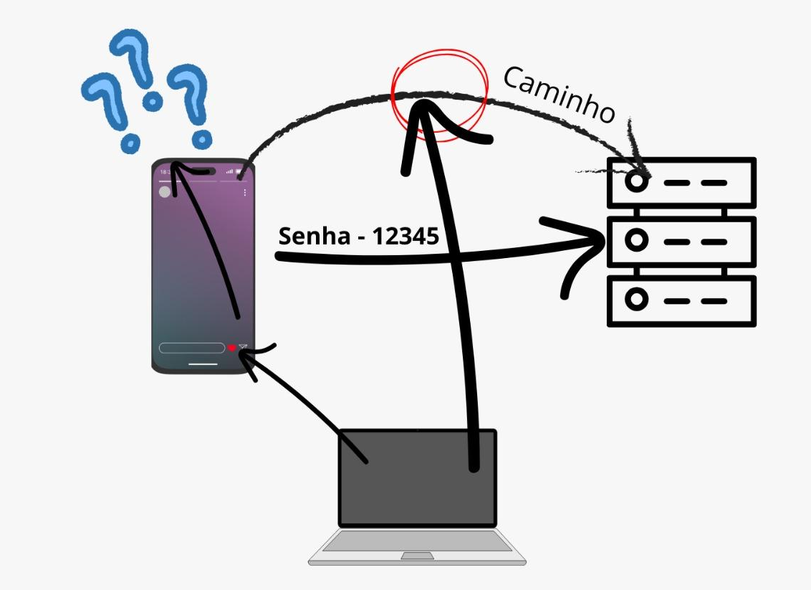

**Teste Individual - [**Davide Ferreira**](mailto:davide.ferreira.2024154@my.istec.pt)**

` `**MITRE ATT&CK -** Forced Authentication - Autenticação Forçada

**O que é:** 

É uma técnica usada por atacantes para forçar um sistema ou utilizador a enviar automaticamente as suas credenciais para um servidor controlado pelo atacante. 

**Como funciona:** 

O ataque de Autenticação Forçada consiste em levar o sistema da vítima a iniciar automaticamente um processo de autenticação para um servidor controlado pelo atacante. Este processo ocorre sem que o utilizador escreva qualquer senha, pois o sistema operativo.

**Exemplo de diversas formas estes situações:** 

**Spearphishing:** É um documento malicioso que pode conter um recurso  que é carregado automaticamente quando o documento é aberto. 

**Ficheiro LNK ou SCF modificado**  

Um atalho.LNK(ficheiro de atalho windows) de comandos que pode ser manipulado para apontar o ícone para um caminho externo para obter o recurso, expondo as credenciais das vítimas. 

**Um Exemplo:** 

  

**Explicação**:

Na minha explicação, temos um dispositivo que vai aceder ao servidor, o qual tem a senha “12345”. Davide Ferreira, usando o seu computador, coloca o telefone sem internet e analisa o caminho de comunicação entre o telefone e o servidor para descobrir a senha e aceder ao servidor como se fosse o telefone.\
**Webgrafia**: 

[Site- Forced Authentication - Autenticação Forçada](https://attack.mitre.org/techniques/T1187/) 

[O meu exemplo ](https://www.canva.com/design/DAG5zoW0GVU/omL7eqaZyuCVqEHovUu3yg/edit?utm_content=DAG5zoW0GVU&utm_campaign=designshare&utm_medium=link2&utm_source=sharebutton)

` `**|||** ISTEC do Porto - Instituto Superior de Tecnologias Avançadas do Porto
